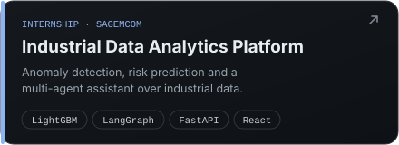
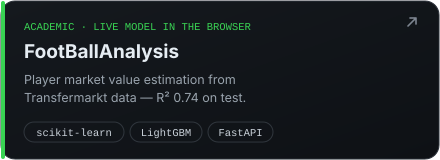
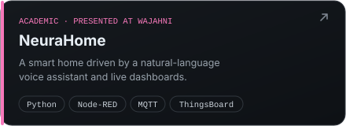

  

  
  
  
  

 

## 🧰 Toolbox

<table>
  <tr>
    <td width="150"><b>🧠 AI &amp; ML</b></td>
    <td>
       
      
      
      
      
      
      
      
      
      
    </td>
  </tr>
  <tr>
    <td><b>🌐 Development</b></td>
    <td></td>
  </tr>
  <tr>
    <td><b>🗄️ Data &amp; tools</b></td>
    <td></td>
  </tr>
  <tr>
    <td><b>📡 IoT</b></td>
    <td>
      
      
      
      
    </td>
  </tr>
</table>

## 🚀 Featured work

  
  
  
  
  
  

Every card opens the project on my portfolio: architecture diagrams, captures, and a model you can try.

## 📊 Activity

  
  

  <picture>
    <source media="(prefers-color-scheme: dark)" srcset="https://raw.githubusercontent.com/RayenSansa03/RayenSansa03/output/github-snake-dark.svg">
    
  </picture>

The banner is a real denoising autoencoder (35→16→2→16→35, trained with scikit-learn): each letter of my name is stored as two numbers and drawn back by its decoder. Code in <a href="scripts">scripts/</a>.

